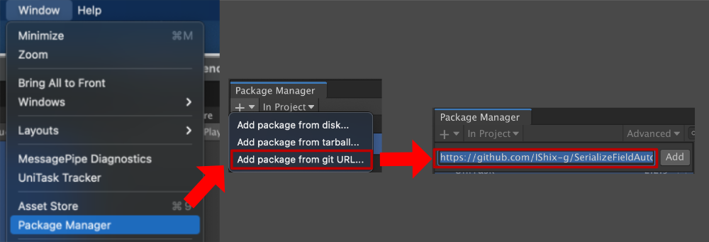

# Auto Reference Attribute
Easily attach the script you created to `SerializeField`.  
It collects the references on the Hierarchy and displays them in a drop-down.


## Just give it an `AutoReference` attribute.

```c#
public class Example : MonoBehaviour
{
    [SerializeField, AutoReference] MyScript script;
```

# Why use Auto Reference Attribute?
- It has better performance than `GetComponent`.
- It's easy to add `AutoReference`.
- If a script goes missing, you can reconfigure it by simply selecting it.

# Available Types
- Class(MonoBehaviour)
- Class(MonoBehaviour)[] array
- List<Class(MonoBehaviour)> List

> - It is only supported on Hierarchy.
> - UnityEngine's api is NOT supported due to performance reasons.
> - You can get up to child objects.

# Notes on Arrays and Lists

For some reasons, it will not work with **0**, so enter **1**.


# Unity Version
Unity 2018.4 higher

# Getting started

## Package Manager

URL : `https://github.com/IShix-g/SerializeFieldAutoReferenceAttribute?path=Assets/Plugins/AutoReferenceAttribute`

### [Unity 2019.3 higher] Install via git URL
Add the Url to Package Manager



### [Unity 2018.4 higher] Add URL manually

Add the Url to `Packages/manifest.json`.

## Unitypackage

[SerializeFieldAutoReferenceAttribute/releases](https://github.com/IShix-g/SerializeFieldAutoReferenceAttribute/releases/)


# Options

## childOnly
For transform children only.

```c#
[SerializeField, AutoReference(childOnly:true)] AutoReferenceExampleObject objChildOnly;
```


## parent
By passing transform as a string, only the children of the selected transform will be targeted.

```c#
[SerializeField] Transform parentTransform;
[SerializeField, AutoReference(parent:"parentTransform")] List<AutoReferenceExampleObject> objList;
```

